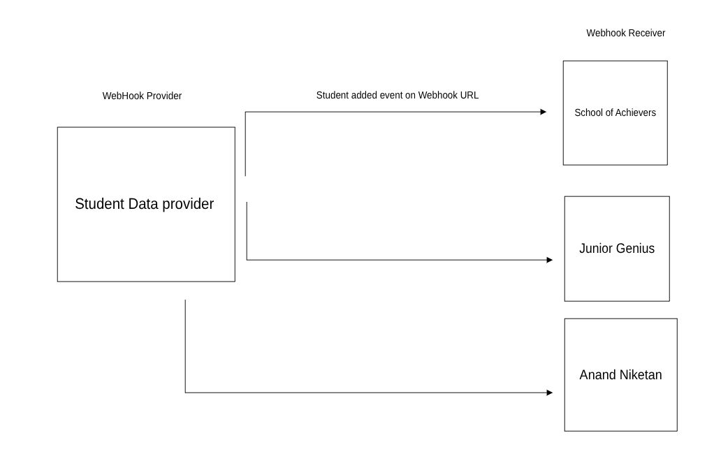

# Webhook POC: Student Data Provider & School Client 🚀

## Live Demo 🌐
- **Student Portal (Demo School A):** [https://achievers-school.netlify.app/](https://achievers-school.netlify.app/)
- **Student Data Provider:** [https://student-data-provider.netlify.app/](https://student-data-provider.netlify.app/)
- **Demo Video:** 📹 [Watch Demo Video](https://simformsolutionspvtltd-my.sharepoint.com/:v:/g/personal/honey_p_simformsolutions_com/ESY5sIQsWtBOpUO2gMeGeAABkHKMEBZEUuE-b9ld4HCbpQ?e=k5xO7x&nav=eyJyZWZlcnJhbEluZm8iOnsicmVmZXJyYWxBcHAiOiJTdHJlYW1XZWJBcHAiLCJyZWZlcnJhbFZpZXciOiJTaGFyZURpYWxvZy1MaW5rIiwicmVmZXJyYWxBcHBQbGF0Zm9ybSI6IldlYiIsInJlZmVycmFsTW9kZSI6InZpZXcifX0%3D)

## Overview
This project demonstrates a custom webhook system between two apps:
- **Student Data Provider** 🏫: Central service where multiple schools register their webhook endpoints. Manages student data and triggers webhooks.
- **School Client (Demo: A School)** 🎓: Receives webhook events from the provider and processes student data.

## Architecture Diagram 🖼️

- **Student Data Provider**
  - Schools register their webhook URLs and receive a one-time secret for HMAC authentication 🔑.
  - When a student is registered for a school, a webhook event is sent to the school's endpoint with a signed payload 📦.
  - Webhook events are logged with retry logic and can be viewed in the frontend 📊.
- **School Client**
  - Exposes a webhook endpoint to receive student data 🌐.
  - Verifies the HMAC signature using the shared secret 🛡️.
  - Processes and stores student data upon successful verification 🗃️.

## Key Concepts 💡
### 1. Webhook Registration
- Schools register via `/register-school` in the provider frontend.
- A secure secret is generated, encrypted, and stored in the provider DB 🔒.
- The secret is shown once to the school for secure storage ⚠️.

### 2. Sending Webhook Events
- When a student is added to a school, the provider:
  - Decrypts the school's secret 🔓.
  - Signs the payload using HMAC SHA256 ✍️.
  - Sends the event to the school's webhook URL with the signature in the header 📬.
  - Implements exponential backoff retry logic (up to 5 attempts) 🔁.
  - Logs each attempt (success/failure) in the database 📝.

### 3. Receiving Webhook Events
- The school client exposes `/webhook` endpoint.
- On receiving an event:
  - Verifies the HMAC signature using the shared secret 🛡️.
  - If valid, processes and stores the student data ✅.
  - Responds with success or error ⚡.

### 4. Webhook Event Logging & Monitoring
- All webhook events (success/failure, attempts, errors) are logged in the provider DB 📚.
- The provider frontend has a `/webhook-logs/:id` page to view logs for each school 🖥️.
- Status is color-coded (🟩 green for success, 🟥 red for failure).

### 5. Security 🔐
- Secrets are encrypted at rest in the provider DB.
- All webhook payloads are signed and verified using HMAC SHA256.
- Only the school and provider know the shared secret.

## How to Run 🏃‍♂️
### Student Data Provider
1. Install dependencies: `npm install` in both `client/` and `server/`.
2. Set environment variables in `server/.env`:
   - `MONGODB_URL` (MongoDB connection string)
   - `WEBHOOK_ENCRYPTION_KEY` (32+ chars)
3. Start server: `npm start` in `server/`.
4. Start frontend: `npm start` or `npm run dev` in `client/`.

### School Client
1. Install dependencies: `npm install` in both `client/` and `server/`.
2. Set environment variables in `server/.env`:
   - `MONGODB_URL` (MongoDB connection string)
   - `WEBHOOK_SECRET` (from provider registration)
3. Start server: `npm start` in `server/`.
4. Start frontend: `npm start` or `npm run dev` in `client/`.

## Main Files & Flow 📂
- **Provider Backend**
  - `controllers/webhookProviderController.js`: Handles registration, sending, and logging webhooks.
  - `models/webhooks.js`, `models/webhookEventLog.js`: DB models for schools and event logs.
  - `services/generateSignature.js`, `services/webhookSecret.js`: Utilities for HMAC and encryption.
- **Provider Frontend**
  - `pages/RegisterSchool.tsx`: School registration UI.
  - `pages/WebhookLogs.tsx`: Webhook event log viewer.
  - `components/SchoolCard.tsx`: School info and log access.
- **School Backend**
  - `controllers/webhookController.js`: Receives and verifies webhook events.
  - `models/student.js`: Stores student data.
  - `services/generateSignature.js`: Signature verification utility.

## Features ✨
- Modern UI with Tailwind and Ant Design.
- Secure, scalable webhook system.
- Retry and logging for reliability.
- Color-coded event logs for monitoring.
- Easy integration for new schools.

## Extending ➕
- Add more event types (e.g., student updated, deleted).
- Integrate with other school systems.
- Add admin dashboard for provider.
- Enhance log filtering and analytics.
- Add retry queue or email logic if all webhook sent events fail.

## Troubleshooting 🛠️
- If signatures don't match, ensure both sides use the exact same payload string and secret.
- Check environment variables and DB connections.
- Use `/webhook-logs/:id` to debug webhook delivery issues.

---
This POC demonstrates a robust, secure, and extensible webhook integration pattern for multi-tenant school data systems. 🎯
